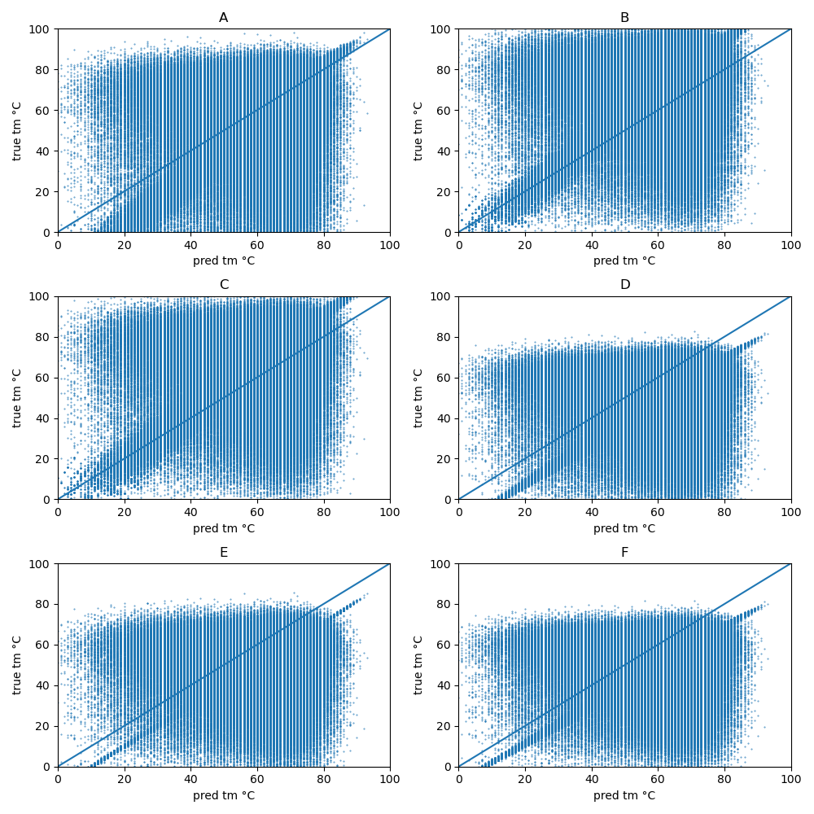

# commit notes

## worked on:
- primer design

## progress
### tm calcs

- **q5** - in [tmdata/nebq5](tmdata/nebq5) i used selenium to collect data for TM°C for >500,000 random primer sequences. their tool works client side so it's quite fast and doesn't error much. played with different primer3 params and tried using scipy and torch to optimize them to predict. not much success, but i didn't try a dmso term: -0.75°C * (%dmso). pic:

- **q5** looks like they're using nearest neighbor rules in [tmdata/nebq5/tmcalc.js](tmdata/nebq5/tmcalc.js) - still haven't managed to reverse engineer that. finding it difficult to read js cde.
- **q5** tried fitting some neural networks to the dataset on a regression task. tried deep CNNS and a CNN->LSTM(H0) -> linear. no luck.
- **q5** ultimately decided that i'd use agilent quickchange instead since you can do up to 4 mutations in one reaction. i don't think you can do that with q5.

- **quickchange** - in [tmdata/agilent-quick-change](tmdata/agilent-quick-change) i used a selenium script to get data from the agilent primer design tool using bm3 as a template and random mutations at random positions. the primer design tool works server side, so it's slow and after a few attempts the page is blocked. i got about 55 points. [tmdata/agilent-quick-change/fit_params.py](tmdata/agilent-quick-change/fit_params.py) used torch to attempt to fit params, for some reason, the loss was exactly the same in each iteration - i'm not sure why, maybe i wasn't backpropagaing properly or maybe it was stuck in illegal parameter space.
- **quickchange** - [tmdata/agilent-quick-change/adjust_params.py](tmdata/agilent-quick-change/adjust_params.py) was used to rationally adjust the params. went for:
	- monovalent salt: 25 mM
	- divalent salt: 0.5 mM
	- dntp: 0.8 mM
	- dna: 1 nM
	- dmso: 8%

### mxn.py
- CDS.mutate( -- makes primer - it already has some of the variables like the codon and area of sequence, so that's what I'm doing for now. primers made with CDS.make_primers( and added to CDS.primers . updates sequence with new codon each time (chosen based on e.coli bias)
- CDS.make_primers( - compares old and new sequence - stateful. should make this optional? defines some score functions like |calculated tm - 78| & terminal GC content. 78°C is what the agilent designed primers come out at. used simulated annealing to opimize left and right arm length. works well. returns dict with primer and additional calcs like homodimer tm.

### testing
- developed features with a test.py that reads the BM3 mutations from connecting the dots and creates all mutations and prints a dataframe of the primers. 

## issues
- only designed forward primer - check agilent docs -> 
- statefulness - order mutations are applied matters. this is a problem with overlapping primers if i want to do the pcrs in a different order. 
	- i should start making <4 mutations at a time to start with 

- mxn calculated tm vs agilent - i should make some comparisons! test with a selenium script?
- tangled code - i should try some teardown / shuffled variants of the CDS object
- ui - needs field testing i think, can definitely be improved

## todo
- i'll generate some priemrs for some connecting the dots mutants and compare that to what the agilent tool designs, then order and see how it goes in the lab. 
